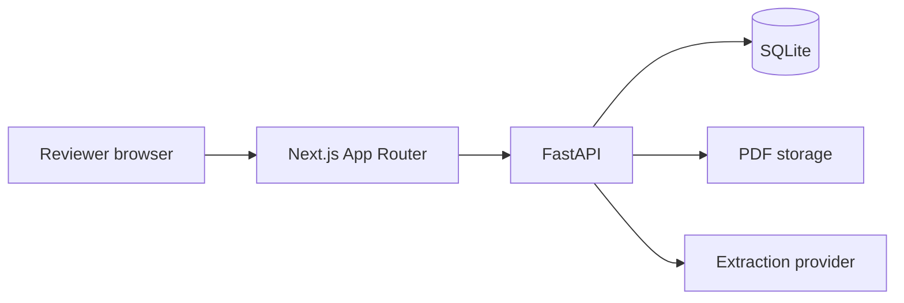
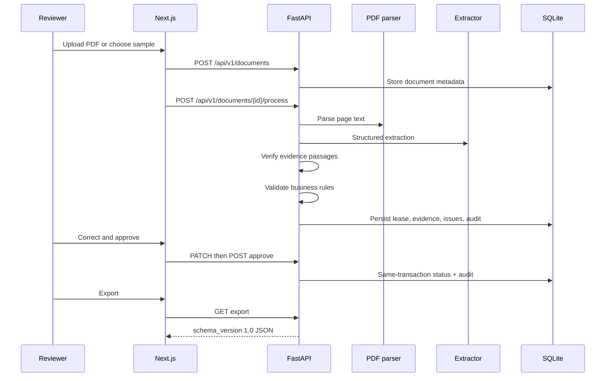

# Architecture

LeaseFlow AI is a modular monolith: one FastAPI process, one Next.js UI, and one relational database.

## Component diagram

The backend owns documents, extractions, leases, evidence, validation issues, audit events, and export events. The frontend is a review console. It does not keep an authoritative copy of lease data.

## Sequence diagram

## Data model

Core tables match the assignment:

- `documents`: upload metadata, content hash, processing status
- `leases`: authoritative business record, optimistic `version`
- `extractions`: provider output kept separate from the lease
- `field_evidence`: page, passage, extracted value, evidence status
- `validation_issues`: blocking / warning / information, with `resolved_at`
- `audit_events`: actor, event type, change details
- `export_events`: schema version and payload hash

Monetary amounts use `Numeric(14, 2)`. Dates use SQL `Date`. IDs are UUID strings for SQLite/PostgreSQL portability.

## Extraction and approval flow

Persisted document states: `uploaded` → `processing` → `awaiting_review` → `approved`, or `failed`.

Lease states: `draft` / `awaiting_review` → `approved`.

The workflow is ordinary Python in `app/workflows/processing.py`:

1. Parse PDF text
2. Call the configured provider
3. Verify each evidence passage against page text
4. Copy only evidence-backed values into the lease
5. Run deterministic validators
6. Wait for a human
7. Allow correction + revalidation
8. Approve only when no blocking issues remain
9. Export the versioned contract

The LLM never approves, rejects, or exports.

## Security and reliability boundaries

Implemented now:

- Upload size limit, PDF header check, randomized stored filenames
- Restricted CORS from configuration
- Secrets from environment variables
- Parameterized SQLAlchemy access
- Bounded LLM timeout, retries, and response size
- Correlation IDs on responses
- No stack traces in API bodies
- Document content is not written to application logs

Not implemented, and not claimed:

- Authentication, SSO, RBAC, or tenant isolation
- Object storage virus scanning
- Cross-region replication or HA

This is a labeled single-user demo.
