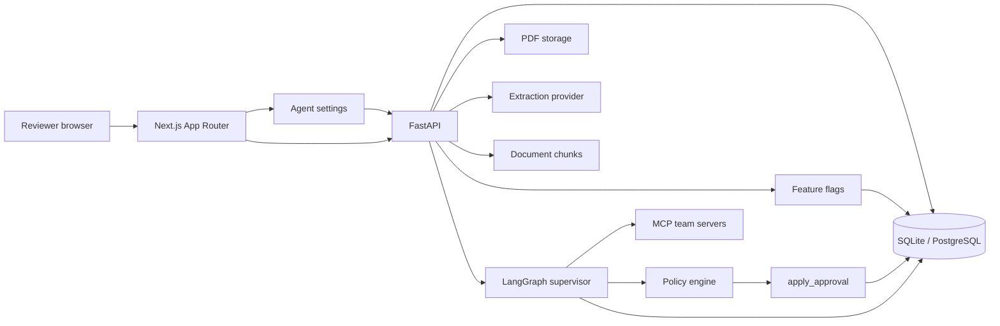
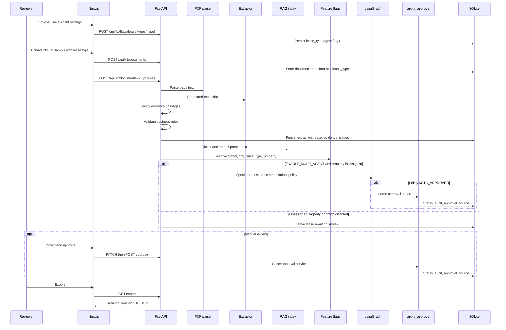

# Architecture

LeaseFlow AI is a modular monolith: one FastAPI process, one Next.js UI, and one relational database.

The original take-home slice is still the system of record: upload → extract → evidence → validate → review → approve → export. RAG, MCP specialists, LangGraph, and lease-type agent settings sit on top of that slice. They do not replace lease rows or create a second approval path.

## Component diagram



The backend owns documents, extractions, leases, evidence, validation issues, feature flags, workflow runs, audit events, and export events. The frontend is a review console plus Agent settings. It does not keep an authoritative copy of lease data or flags.

## Logical layers

```
Browser
  Dashboard / Upload / Review / Knowledge / Agent settings
FastAPI
  api -> workflows/processing -> extraction, RAG
                              -> agents/graph (when flagged and property-bound)
                              -> policy/flags + policy/engine
                              -> services/approval.apply_approval
                              -> mcp allowlisted client
  domain constants, SQLAlchemy models, Alembic
```

Packages stay inside one process. MCP servers are official FastMCP modules invoked in-process for the demo.

## Where RAG, MCP, and data live

| Piece | Package | Runtime | Persistence |
| --- | --- | --- | --- |
| RAG | `backend/app/rag/` | Indexed during `POST /api/v1/documents/{id}/process`. Search/ask from `/knowledge` and `/api/v1/rag/*`. | `document_chunks` (`backend/app/models/document_chunk.py`). Local hashed embeddings stored as JSON floats. Compose enables the `vector` extension; similarity is still computed in the app. |
| MCP | `backend/app/mcp/` | Allowlisted `McpClient` called by LangGraph specialists. FastMCP modules in `backend/app/mcp/servers/`. | Catalog data is in `catalog.py` (not a PMS database). Each tool call is written to `mcp_tool_calls`. |
| Relational data | `backend/app/models/`, `backend/app/db/` | SQLAlchemy + Alembic. URL from `backend/app/core/config.py`. | Local: `backend/data/leaseflow.db`. Compose: PostgreSQL `leaseflow` database (`leaseflow-pg` volume). |
| PDF files | `storage_dir` | Upload API writes randomized filenames. | Local: `backend/data/uploads/`. Samples used by demo buttons: `samples/*.pdf`. |
| Flags and workflow | `backend/app/policy/`, `backend/app/agents/` | Settings UI and processing. | `feature_flags`, `workflow_executions`, `agent_executions`, `policy_evaluations`. |

There is no separate RAG service, MCP host, or object store in the assignment default. Compose adds Postgres + a catalog health process only.

## Frontend surfaces

| Route | Role |
| --- | --- |
| `/` | Dashboard counts and recent documents |
| `/upload` | PDF or demo sample, plus `commercial` / `residential` lease type |
| `/leases/{id}` | Review, evidence, issues, specialist statuses, export |
| `/knowledge` | Scoped RAG search |
| `/settings` | Enable or disable specialists per lease type |

Upload sends `lease_type` with the document. Processing resolves flags for that type. Review shows the same effective flags the backend used.

## Sequence diagram



## Data model

Core tables match the assignment:

- `documents`: upload metadata, content hash, optional `sample_key`, `lease_type` (`commercial` or `residential`, default `commercial`), `property_id` (default `prop-unassigned`), processing status
- `leases`: authoritative business record, optimistic `version`, `approval_source`
- `extractions`: provider output kept separate from the lease
- `field_evidence`: page, passage, extracted value, evidence status
- `validation_issues`: blocking / warning / information, with `resolved_at`
- `audit_events`: actor, event type, change details
- `export_events`: schema version and payload hash

Platform tables added on this branch:

- `document_chunks`: RAG passages with organization/property filters (not a second system of record)
- `feature_flags`: `scope_type` + `scope_id` + `flag_key` (global, organization, lease_type, property)
- `workflow_executions`: one LangGraph run per processed assigned lease
- `agent_executions`: specialist status, findings, errors
- `mcp_tool_calls`: allowlisted tool request/response
- `policy_evaluations`: decision, reason codes, dry-run flag

Monetary amounts use `Numeric(14, 2)`. Dates use SQL `Date`. IDs are UUID strings for SQLite/PostgreSQL portability.

## Feature flags and lease types

Effective flags layer in this order:

1. Code defaults
2. Global rows
3. Organization rows (ceiling)
4. Lease-type rows for specialist-agent toggles
5. Property rows (may only tighten approval; they do not override specialist-agent flags)
6. Emergency kill switch `AUTO_APPROVAL_KILL_SWITCH`

A lower scope cannot turn on a required agent or auto-approval that a higher scope disabled. Optional agents (insurance, recommendation) can be enabled on a lease type even when the global default is off. Reviewers write only specialist-agent flags from `/settings` through `POST /api/v1/flags/lease-types/{lease_type}`.

Seeded defaults:

| Scope | Notable defaults |
| --- | --- |
| Commercial | Leasing on, insurance off, auto-approval allowed if property policy permits |
| Residential | Leasing off, insurance on, auto-approval off, manual review required |
| Property A Prosper | Auto-approval allowed |
| Property B Dallas | Always manual |
| Property C Logistics | Auto-approval off; escalate on conflict |

## Extraction and approval flow

Persisted document states: `uploaded` → `processing` → `awaiting_review` → `approved`, or `failed`.

Lease states in the demo flow: `awaiting_review` → `approved`. A `draft` enum value exists but is unused.

The workflow is ordinary Python in `app/workflows/processing.py`, then `app/services/approval.py`:

1. Parse PDF text
2. Call the configured provider (fixture match is content hash — manifest or live catalog file — or explicit `sample_key` only)
3. Verify each evidence passage against page text
4. Copy only evidence-backed values into the lease
5. Run deterministic validators
6. Index chunks for RAG
7. Resolve flags for the document's organization, property, and `lease_type`
8. Run LangGraph only when `ENABLE_MULTI_AGENT` is on and `property_id` is not `prop-unassigned`
9. Policy may request auto-approval; it cannot write `lease.status` itself
10. `apply_approval` revalidates, writes approved status and audit, or leaves the lease in review
11. Humans correct and approve through the same helper
12. Export the versioned contract only after approval

Original samples such as **Complete valid lease** stay on `prop-unassigned` so the review/export slice can be shown without specialists. Property A/B/C demo buttons, or a file whose content hash matches a seeded sample, bind a property and start the graph.

Extraction output stays in `extractions` / `field_evidence`. Agents, RAG, and MCP enrich context. They do not replace the lease record or create a second approval path.

The LLM never approves, rejects, or exports.

## Security and reliability boundaries

Implemented now:

- Upload size limit, PDF header check, randomized stored filenames
- Restricted CORS from configuration
- Secrets from environment variables
- Parameterized SQLAlchemy access
- Bounded LLM timeout, retries, and response size
- Correlation IDs on responses
- No stack traces in API bodies
- Document content is not written to application logs
- MCP tools are allowlisted; responses cannot override authorization or approval
- Flags are fail-closed: a disabled required agent skips that specialist and blocks auto-approval

Not implemented, and not claimed:

- Authentication, SSO, RBAC, or tenant isolation
- Object storage virus scanning
- Cross-region replication or HA

This is a labeled single-user demo.
