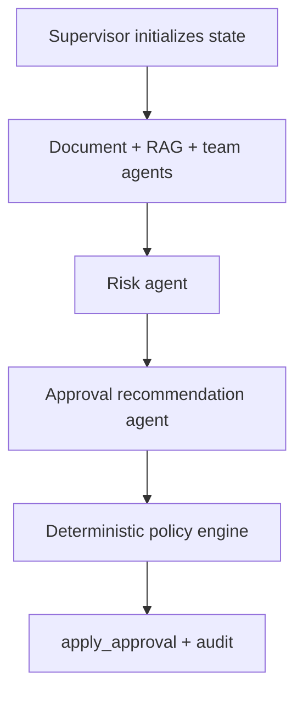

# Multi-agent, RAG, and MCP

LeaseFlow remains a modular monolith. Logical layers live in one FastAPI process.

```
API -> application workflows -> AI (RAG, agents) -> integrations (MCP) -> domain -> infrastructure
```

## Multi-agent graph



Independent team agents are registered in `AGENT_REGISTRY`. Adding Insurance Compliance only requires a catalog entry, an optional flag, and a registry row. Other specialists do not change.

## RAG ingestion

PDF → page text → section-aware chunks → local embeddings → `document_chunks` → filtered cosine search.

Metadata stored with every chunk: organization, property, lease, document, version, chunk id, heading, page range, source text, content hash, embedding model/version.

Vector queries always filter organization and allowed properties.

## Vector schema

`document_chunks.embedding` is a JSON float array so SQLite tests and PostgreSQL both work. Docker Compose starts `pgvector/pgvector:pg16` and enables the `vector` extension. Similarity is computed in the application against stored vectors, not keyword stubs.

## MCP contracts

Local transport for the demo is in-process invoke plus official FastMCP stdio servers:

| Server | Tools |
| --- | --- |
| property | `get_property_profile`, `get_property_maintenance_status` |
| finance | `get_tenant_financial_status`, `get_property_financial_thresholds` |
| legal | `get_legal_review_status`, `get_approved_clause_templates` |
| leasing | `get_leasing_context`, `get_lease_negotiation_status` |
| insurance | `get_insurance_compliance` (optional) |

MCP responses cannot override application authorization or approval policy.

## Feature-flag precedence

1. Code defaults
2. Global rows
3. Organization rows (ceiling)
4. Property rows (may only tighten approval)
5. Emergency kill switch `AUTO_APPROVAL_KILL_SWITCH`

A property cannot enable auto-approval if the organization or global policy disabled it. Frontend flags are display-only.

## Approval policy

Outputs: `AUTO_APPROVED`, `MANUAL_REVIEW_REQUIRED`, `ESCALATED`, `BLOCKED`.

Fail-closed on missing evidence, failed mandatory tools/agents, disabled required agents, stale versions, kill switch, or blocking validation. The recommendation agent is advisory. The policy engine may request `AUTO_APPROVED`. Only `apply_approval` writes lease approval status, using the same validation and audit rules as `POST /api/v1/leases/{id}/approve`.

## How to add an agent or MCP server

1. Add fictional records and allowlisted tools in `app/mcp/catalog.py`.
2. Build a FastMCP module with `build_server("name")`.
3. Register the agent flag and `AGENT_REGISTRY` / `SPECIALIST_TOOLS` entry.
4. If the agent is optional, keep it out of `MANDATORY_AGENTS`.
5. Add tests for discovery, authorization, and policy impact.
